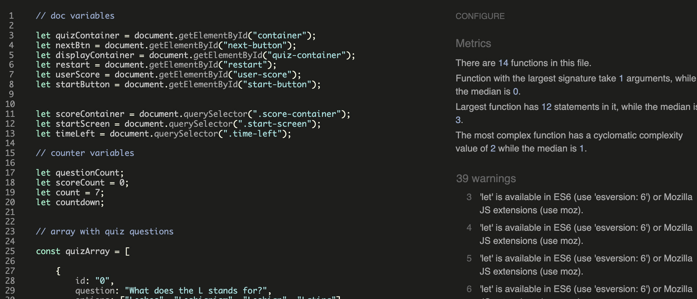

# LGBT Quiz - What does the letters mean?

The LGBT Quiz challenges your knowledge of queer indentities. When most people look at longer versions of the LGBT acronym, such as LGBTQIA+, they they don't what all this letters mean. The quiz is a fun way to bring awareness as the user plays against time to identify the correct term. At the end, the user is directed to a resource where they can learn more.

[Live Website](https://jordanabraga.github.io/lgbtqia-quiz/)

## Features

### Existing Features

- #### Start Card

  - As the window loads, the user sees the title ("What does the letters in LGBTQIA?") and is prompted to answer the question by starting the quiz.

- #### Quiz Cards

  - As the quiz starts, a time counter is displayed along with a question and multiple choices.

  - The LGBTQIA+ acronym is on top of the page. The color changes according to the LGBT+ raindow flag colors. This feature was added as a fun, gay detail, but it also highlights the acronym and creates a stronger assocation between the content and the question, "What does it mean?"

  - After selected, the question is highlighted in green (if right) or red (if wrong), and the next card appears. If no answer is selected after 10 seconds, the next question appears.

- #### Score Card

  - The score is provided at the end showing how many questions were correct out of the total.

  - A button with a special background directs the user to a resource about LGBTQIA+ identities.

  - Another button creates the option to restart the quiz.

### Features Left to Implement

- Different text and gifs depending of how much the user scored.

- Add a glitter effect.

- And if this were part of a bigger awareness campaign, content explaining different terms and a more questions based on a longer LGBT+ acronym.

## Design

The design is minimalist, fresh and gay. Details such as the colors of the LGBT raindow flag were added in order to direct the user.

## Testing

- I confirmed that the game score is always correct.

- I tested in different screen sizes to make sure the text is readable and easy to understand.

- I confirmed that this project is responsive, looks good and functions on all standard screen sizes using the devtools device toolbar.

## Validator Testing

- ##### HTML
  - The Nu HTML Checker (W3C) is used to validate HTML documents. The files passed without any errors.

HTML Validation

 

- ##### CSS
  - The W3C Jigsaw CSS Validation Service is used to validate CSS documents. The file passed without any errors.

CSS Validation

 

- ##### JavaScript
  - The JSHint is used to validate JavaScript documents. The files passed without any errors.

JS Validation

 

## Deployment

[Click Here To See The Live Website](https://jordanabraga.github.io/lgbtqia-quiz/)

- ### Deploy
The website was deployed through the use of GitHub Pages, a feature built in to GitHub. This can be done by following the steps below.
1. In the desired repository, click on "Settings" from the top menu.
2. From the side menu to your left, select "Pages" in the "Code and automation" section.
3. Make sure the "Source" option is set to "Deploy from a branch"
4. Select the desired "Branch" from the drop down below (main branch in most cases, making sure the director is set to /(root)).
5. Select "Save", and after it refreshes the page, you will see a box at the top of the page providing you with the URL of your now published site.

To contribute or check the code yourself, you can fork or clone the repository as well.

### Fork
1. Go to the desired repository
2. Click "Fork" in the upper right corner
3. Select the owner, and set the repository name. A description can be added if desired
4. Choose whether to copy the default branch, or all branches
5. Click "Create Form"

### Clone

1. Go to the desired repository
2. Click the "Code" button at the top of the files section of the page
3. Select your desired method for cloning (HTTPS/SSH/GitHub CLI)
4. Open Git Bash
5. Change the current working directory to the location where you want the cloned directory
6. Type "git clone", and then paste the URL you copied earlier. It will look like this, with your GitHub username instead of "YOUR-USERNAME": "$ git clone https://github.com/YOUR-USERNAME/DESIRED-REPOSITORY"
7. Press Enter. Your local clone will be created.
